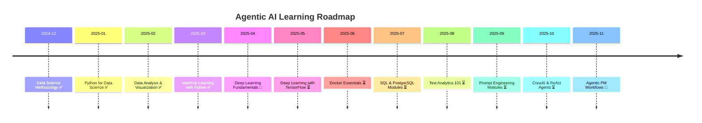

```mermaid
timeline
    title Agentic AI Learning Roadmap
    2024-12 : Data Science Methodology ✅
    2025-01 : Python for Data Science ✅
    2025-02 : Data Analysis & Visualization ✅
    2025-03 : Machine Learning with Python ✅
    2025-04 : Deep Learning Fundamentals 🚧
    2025-05 : Deep Learning with TensorFlow ⏳
    2025-06 : Docker Essentials ⏳
    2025-07 : SQL & PostgreSQL Modules ⏳
    2025-08 : Text Analytics 101 ⏳
    2025-09 : Prompt Engineering Modules ⏳
    2025-10 : CrewAI & ReAct Agents ⏳
    2025-11 : Agentic PM Workflows 🔧
```
