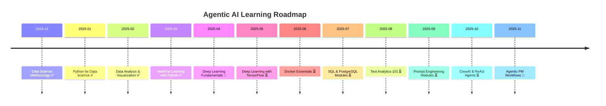

# Agentic AI & Data Stack Roadmap

This roadmap outlines my 12-week part-time learning plan, integrating CognitiveClass.ai courses with hands-on build milestones in data science, NLP, prompt engineering, and agentic AI.

## 🧱 Weeks 1–4: Backend & NLP Foundations

- ✅ Docker Essentials → Finalize `.devcontainer`, prep for deployment
- ⏳ SQL & PostgreSQL → Solidify review metadata models, audit trail
- ⏳ Text Analytics 101 → Stub clause enrichment, structure recognition
- ⏳ Build Your Own Chatbot → Prototype reviewer guidance or PM agent dialog

## 🤖 Weeks 5–8: Prompting + Agentic AI

- ⏳ Prompt Engineering for Everyone → Design prompts for meeting minutes, status reports
- ⏳ The Art of Prompt Engineering → Refine fallback logic, reviewer guidance
- ⏳ CrewAI 101 → Explore multi-agent flows for PM tasks
- ⏳ Build a ReAct Agent → Prototype fallback reviewer assignment or clause classifier

## 🧠 Weeks 9–12: Deep Learning + UI Integration

- 🚧 Deep Learning Fundamentals → Understand model architecture for clause classification
- ⏳ Deep Learning with TensorFlow → Prototype classifier or recommender
- ⏳ React basics (external) → Build chunk review UI, PM agent dashboard
- ⏳ Portfolio polish → Write GitHub README, blog post, LinkedIn update

## 🧭 Milestones

- ✅ Foundation complete (Python, ML, Viz)
- 🚧 Intake pipeline + review model stub
- ⏳ Agent logic for PM flows + enrichment agent
- ⏳ Public-facing portfolio + agent demo

---

